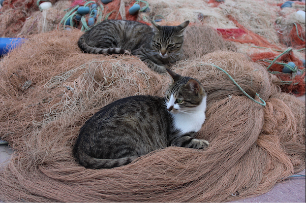

readme = """
# OWLSAM Colab Demo

This project integrates:

- **OWL-V2**: Zero-shot object detection
- **SAM (Segment Anything Model)**: 2D mask generation

You can input an image and candidate labels (comma-separated) to detect objects and get their masks.

## How to Run

1. Install requirements: `pip install -r requirements.txt`
2. Run `app.py` or the Colab cell
3. Open the provided Gradio link (with `share=True`) to use the demo

## Example

"""

with open("README.md", "w") as f:
    f.write(readme)
# OWL-V2-2D-segmentation
